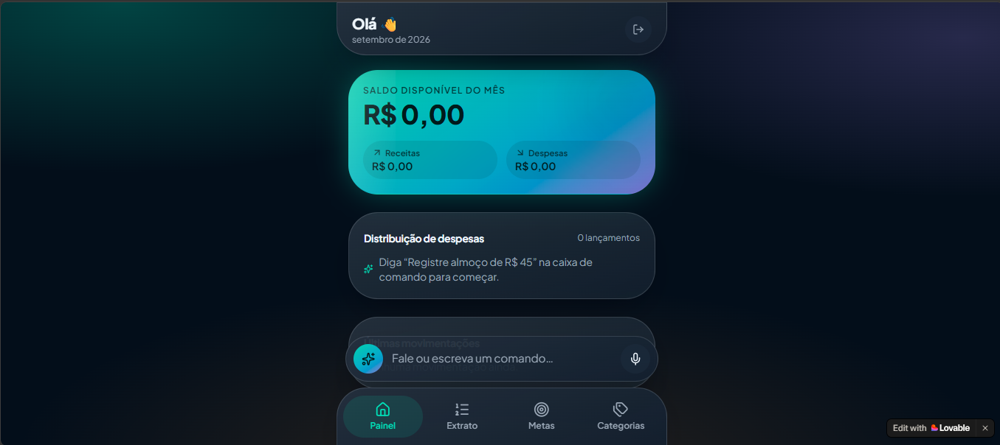
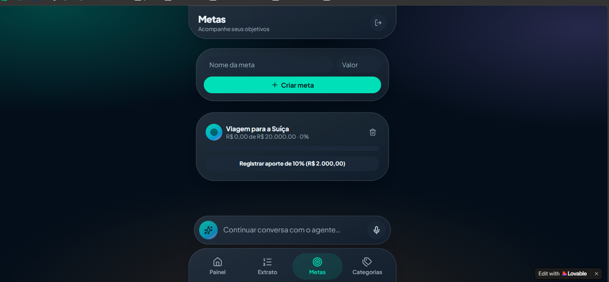

# Fluxo — Gestão Financeira por Conversa

> **Projeto desenvolvido como desafio da DIO (Digital Innovation One) explorando os conceitos de Vibe Coding, Engenharia de Prompt, UI/UX Apple e desenvolvimento de MVP com IA.**

---

## Sobre o Projeto & Problemas Resolvidos

O **Fluxo** nasce para eliminar a principal barreira da organização financeira pessoal: **o atrito e a burocracia da entrada manual de dados**. A grande maioria das pessoas abandona o controle de gastos nas primeiras semanas porque preencher planilhas ou categorizar compras em formulários tradicionais é uma tarefa tediosa, cansativa e sem engajamento.

O **Fluxo** transforma essa experiência ao substituir formulários rígidos por uma **interface conversacional contínua, simples e inteligente**, combinando o conceito de **Vibe Coding** com diretrizes visuais modernas inspiradas no ecossistema Apple (iOS/macOS).

### Problemas Resolvidos

1. **Abandono do Controle Financeiro por Cansaço Operacional**: Elimina a necessidade de abrir múltiplos menus e formulários para registrar uma despesa.
2. **Falta de Personalização nos Insights**: O Agente Financeiro analisa os gastos no contexto do usuário e fornece recomendações preventivas em tempo real.
3. **Complexidade Visual em Gráficos Tradicionais**: Substitui painéis poluídos por cartões e widgets minimalistas dentro do próprio feed de conversa.
4. **Resistência de Usuários Iniciantes**: Utiliza linguagem natural e amigável, permitindo que qualquer pessoa interaja como se estivesse conversando com um consultor pelo chat.

---

## Pontos Fortes do Projeto

* **Interface Conversacional Inteligente (Mobile First)**: Centraliza toda a jornada do usuário em um feed de chat limpo e intuitivo.
* **UI/UX Inspirada na Apple**: Utilização de componentes minimalistas, cantos arredondados (*squircles*), sombras suaves, tipografia refinada e forte legibilidade visual.
* **Processamento de Linguagem Natural**: O usuário registra transações com frases simples do dia a dia, como *"Gastei 45 reais no almoço"*.
* **Feedback Contextual Ativo**: O Agente Financeiro cruza novos registros com as metas ativas do usuário instantaneamente.
* **Arquitetura de MVP Enxuta**: Foco estrito em resolver a dor principal sem adicionar funcionalidades desnecessárias.

---

## Imagens Descritivas do Projeto

### 1. Painel Principal & Central de Comandos
> Dashboard do aplicativo exibindo o saldo disponível do mês, atalhos de sugestão e a barra de comando conversacional.



---

### 2. Agente Financeiro & Registro em Linguagem Natural
> Interface do Agente Financeiro processando o comando *"Gastei 45 reais no almoço"* e confirmando o registro da despesa automaticamente.


---

### 3. Acompanhamento de Metas Financeiras
> Tela de acompanhamento de metas personalizadas (ex: *"Viagem para a Suíça"*) com barras de progresso e atalhos rápidos de aporte.



---

## Passo a Passo: Do Prompt à Publicação no Lovable

Todo o processo de desenvolvimento do **Fluxo** seguiu a metodologia de **Vibe Coding**, priorizando clareza de intenção, estruturação de contexto e iterações estrategicamente direcionadas para a IA.

```text
┌─────────────────┐     ┌──────────────────┐     ┌──────────────────┐     ┌──────────────────┐
│  1. Elaboração  │ ──> │  2. Refinamento  │ ──> │  3. Construção   │ ──> │ 4. Publicação &  │
│     do PRD      │     │  no Copilot Web  │     │    no Lovable    │     │   Validação MVP  │
└─────────────────┘     └──────────────────┘     └──────────────────┘     └──────────────────┘
